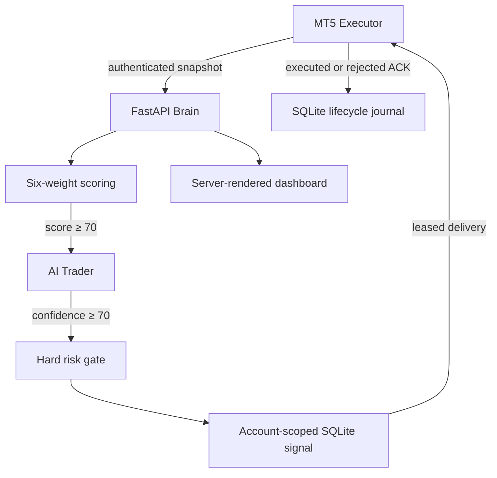

# Architecture

## Trust boundaries

MT5 write endpoints require a shared MT5 secret plus account, terminal, and instance headers. The request body repeats the identity and the API rejects mismatches. Dashboard reads use a separate bearer secret kept in the Next.js server runtime. The unauthenticated WebSocket surface was removed; live browser streaming should only return with a non-leaking session mechanism.

The API key control depends on HTTPS for confidentiality. Terminate TLS at the ingress and never use plain HTTP outside an isolated host network. UTC timestamps reject replayed/out-of-order snapshots and enforce a per-identity minimum ingestion interval.

## Decision invariants

Scoring has exactly six weights: trend 20, RSI momentum 15, volume 20, ATR 15, session 15, and spread 15. Reversal detection is supplied as context and does not add a hidden seventh weight.

AI Trader evaluates BUY, SELL, continuation, reversal, support/resistance, rejection, overextension, and exact target prices. The model can only propose a direction. Deterministic risk and execution layers repeat all hard limits. MT5 performs the final independent validation immediately before `OrderCheck` and `OrderSend`.

AI calls are bounded to 20 seconds without an in-request retry so the synchronous MT5 request remains inside its 30-second timeout. The next market cycle is the retry opportunity; AI errors and timeouts fail closed to `NONE`.

## State and delivery

Signals and journal events use SQLite/WAL so multiple API workers do not share unsafe Python globals. A signal is keyed by `account_id:terminal_id:instance_id`, expires after 60 seconds, and is redelivered only after a short delivery lease if no ACK arrives. Both successful and failed broker attempts are acknowledged and recorded.

Market/dashboard state is latest-state operational telemetry. SQLite journal records `ANALYSIS`, `SIGNAL_CREATED`, `TRADE_EXECUTED`, `TRADE_REJECTED`, and idempotent `TRADE_CLOSED` events separately.
